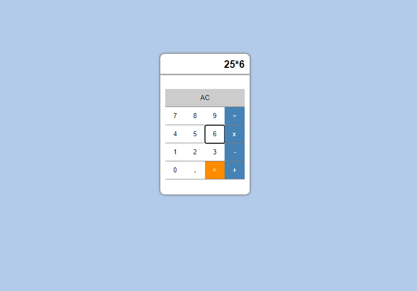

# calculator_app
Basic calculator app in vanilla js

- All in browser
- Vanilla JS ( no libraries or frameworks )
- Single file responsibility
- No pollution of the global namespace
- Styling ( only necessary to center elements on the page )
___
- [Demo](https://vs-silva.github.io/calculator_app/)
___
- [Post - The calculator app](https://vitalinosilva.com/2022/11/24/the-calculator-app/)
---
- [About me](https://vitalinosilva.com/about/)
- [me@vitalinosilva.com](mailto:me@vitalinosilva.com)
